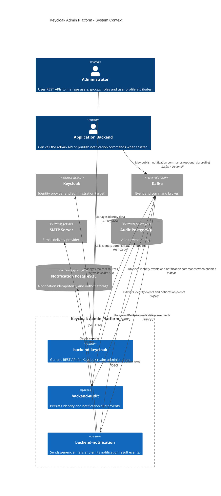
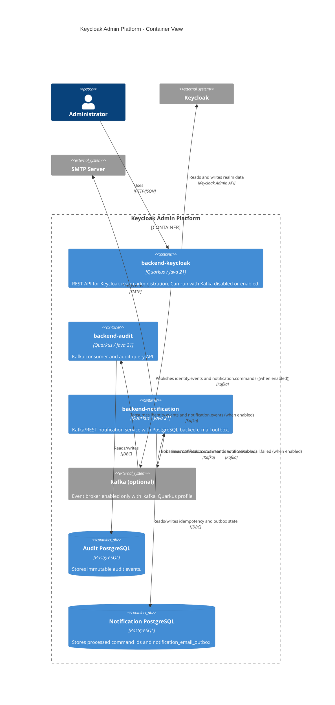

# C4 Architecture

This document shows the current platform architecture using C4-style diagrams.

## System Context

## Container View

## Kafka Enabled Mode

When `IDENTITY_EVENTS_ENABLED=true`, mutating identity operations publish
`identity.events` after Keycloak succeeds. If publication fails, the HTTP
request fails.

When `NOTIFICATION_COMMANDS_ENABLED=true`, the update-password e-mail action
publishes `notification.commands` instead of using Keycloak SMTP. The
notification service persists the command and an outbox row transactionally,
then a scheduled worker sends SMTP and publishes `notification.email.sent` or
`notification.email.failed`.
